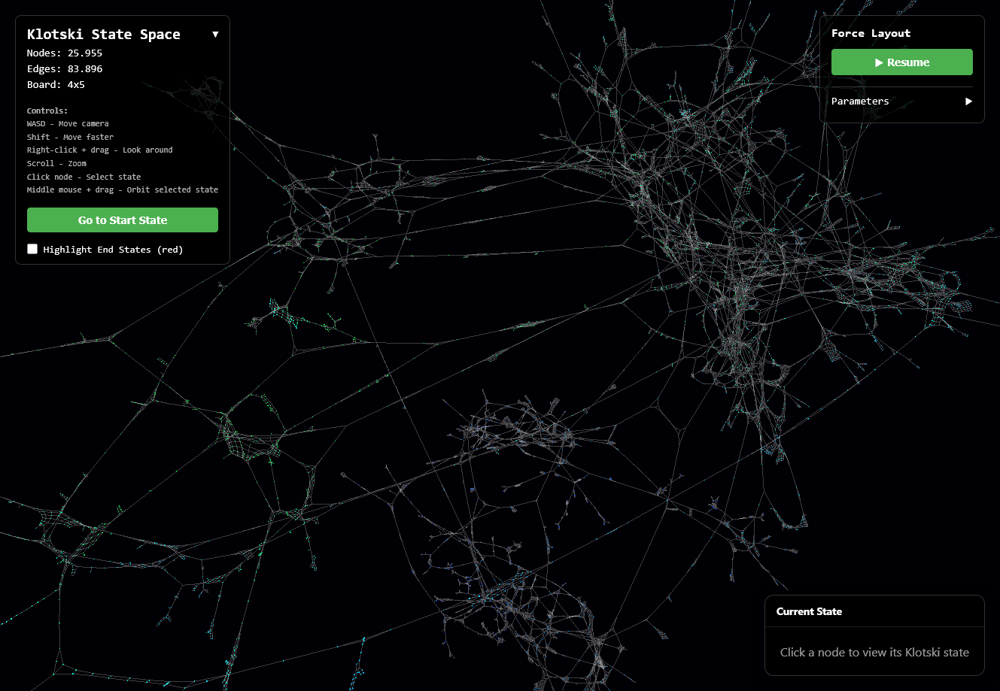
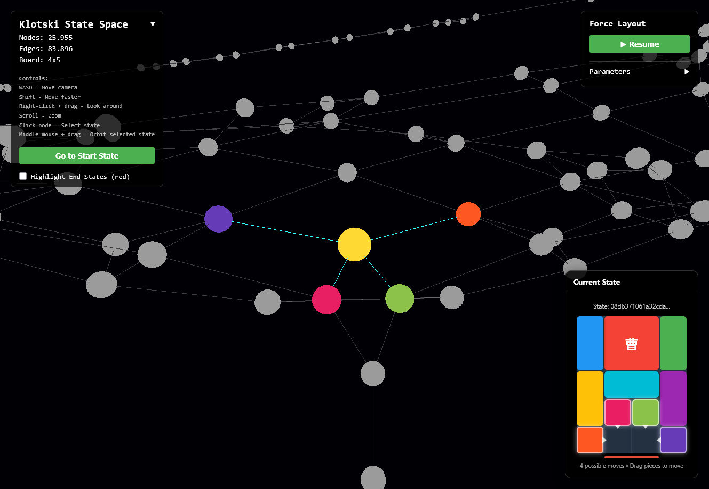

# Klotski Statespace Visualization

This repository contains a custom WebGPU based visualization of the statespace of the classic Klotski puzzle. It allows users to explore the various configurations and solutions of the puzzle interactively, providing insights into the complexity and structure of the statespace. With the help of WebGPU, the visualization is optimized for performance, enabling a smooth and responsive user experience.

The project is heavily inspired by the work of [2Swap](https://github.com/2swap) and his [Video on Klotski Statespace Visualization](https://www.youtube.com/watch?v=YGLNyHd2w10).




## Setup

To run the visualization locally, follow these steps:

1. Clone the repository
2. Navigate to the frontend directory:
   ```bash
   cd frontend
   ```
3. Install the dependencies:
   ```bash
   npm i
   ```
4. Start the development server:
   ```bash
   npm run dev
   ```